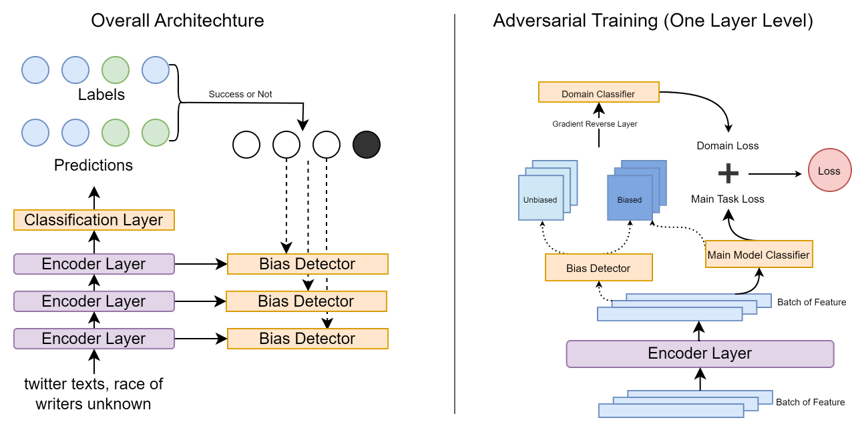

# MABR

PyTorch implementation of the AAAI 2025 paper [MABR: Multilayer Adversarial Bias Removal Without Prior Bias Knowledge](https://ojs.aaai.org/index.php/AAAI/article/view/34764).



This repository contains the code for training and evaluating MABR on the tasks described in the paper, including base training, blind debiasing, multilayer adversarial training, and fairness evaluation.

## Project Layout

```text
MABR/
├── pyproject.toml
├── scripts/
│   ├── analyze_layer_accuracy.py
│   ├── evaluate_fairness.py
│   ├── prepare_initial_checkpoint.py
│   ├── train_base.py
│   ├── train_blind.py
│   └── train_multilayer_bias.py
├── src/mabr/
│   ├── cli.py
│   ├── config.py
│   ├── data.py
│   ├── losses.py
│   ├── metrics.py
│   ├── models.py
│   └── pipeline.py
└── tests/
```

## Installation

```bash
conda create -n mabr python=3.10
conda activate mabr
pip install -e .
```

If you want experiment tracking:

```bash
pip install -e .[tracking]
```

## Data

The default config expects datasets under `../data/<dataset_name>`.

- `biosbias` should be prepared from [Bias in Bios](https://arxiv.org/abs/1901.09451).
- Sentiment experiments can be prepared from the [ELazar and Goldberg data](https://github.com/yanaiela/demog-text-removal/blob/master/src/data/README.md).

## CLI Usage

The primary entrypoint is `mabr`.

```bash
mabr train-base
mabr train-blind
mabr prepare-initial
mabr train-multilayer
mabr analyze-accuracy
mabr eval-fairness
```

Example with overrides:

```bash
mabr train-multilayer \
  --dataset-name biosbias \
  --model-checkpoint roberta-base \
  --checkpoint-epoch 1 \
  --threshold-high 0.99 \
  --threshold-low 0.3
```

You can also use the helper scripts under `scripts/` if you prefer explicit stage-specific entrypoints.

## Citation

```bibtex
@inproceedings{yin2025mabr,
  title={MABR: Multilayer Adversarial Bias Removal Without Prior Bias Knowledge},
  author={Yin, Maxwell J and Wang, Boyu and Ling, Charles},
  booktitle={Proceedings of the AAAI Conference on Artificial Intelligence},
  volume={39},
  number={24},
  pages={25724--25732},
  year={2025}
}
```
